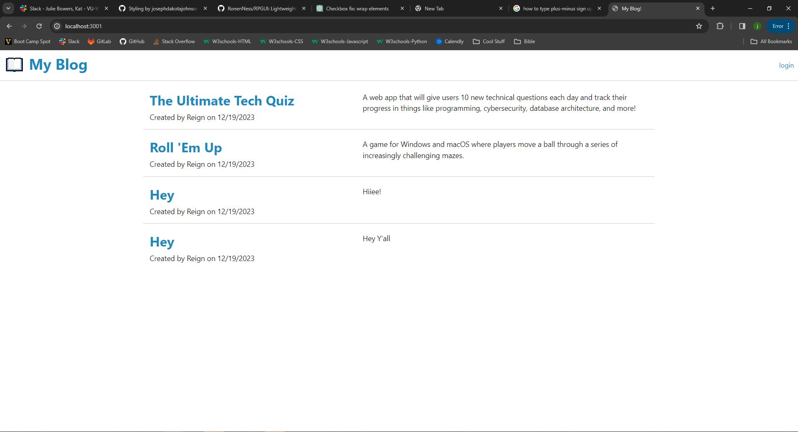

# tech-blog
I want to build a CMS-style blog site similar to a Wordpress site.

## Description

 - I want to build a CMS-style blog site similar to a Wordpress site.

## Table of Contents

  - [Credits](#credits)
  - [Badges](#badges)
  - [Features](#features)
  - [Questions](#questions)
  - [Screenshot](#screenshot)
  - [DeployedApp](#deployedApp)

## Credits

 - This website was coded by Joseph Dakota Johnson.

 - Instructor Caleb Crum helped me during class with various parts of this assignment.

 - Instructor Ethan Dodgen helped me during class with various parts of this assignment.

 - Tutor Andres Jimenez helped me in tutor sessions with many parts to this assignment.

 -  My brother (boot camp graduate) helped out by helping me figure our how to turn in this assignment. [Dylan's GitHub account](https://github.com/dylanstormjohnson)

## Badges

 - HTML
 - CSS
 - JavaScript

## Features

 - When you Sign Up,
 - Then you can Login/Logout.
 - When you click a post to view it,
 - Then you can comment on it too.
 - If the user types a comment that says "Easter Egg", then posts it, the user will have a really lazy Easter Egg.

## Questions

 - If you have any questions for me, my GitHub account is [Dakota's GitHub account](https://github.com/josephdakotajohnson).

## Screenshot

 - This is a screenshot of the application: .

## DeployedApp

 - This is a link to the fully deployed application: (https://tech-blog-1-5d0041176299.herokuapp.com/).
